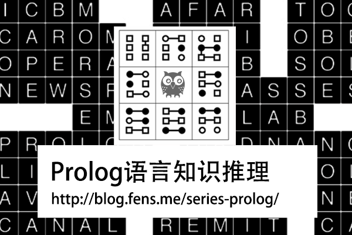

# Prolog语言知识推理系列文章

[Prolog语言知识推理系列文章](http://blog.fens.me/series-prolog/)，(http://blog.fens.me/series-prolog/) 不同编程语言有着不同编程视角，JAVA是面向对象，Nodejs是异步回调，R语言是统计算法，Prolog就是知识推理。每种语言都是独特的，如果想把一门语言学好用好，关键是利用语言的特点，做对的事情。

本系列文章主要介绍Prolog语言，从入门安装到知识推理。Prolog是完全不一样的，他没有复杂的程序结构，也不是为了解决算法问题，而是专注于逻辑推理，擅长解决抽象的问题。

## 文章列表(代码):

+ [prolog语言安装](http://blog.fens.me/prolog-install/) => 01 install
